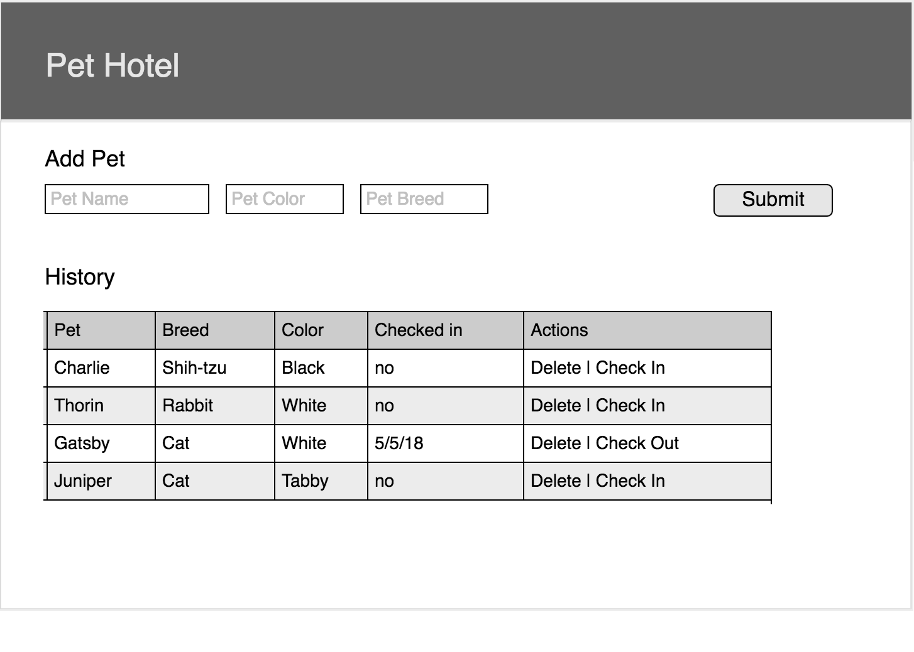

# Pet Hotel Project

> NOTE: __Do not fork this repository.__ Instead, create your own repository from scratch.

## Objectives

- build a full-stack application, writing the backend in a new language
- build confidence w/ SQL statements for CRUD

## Technology

- Python / Flask (web framework)
  - `psycopg2` for DB connection and queries

We are replacing our Node/Express/PG server with other serverside tech. Your RESTful API server needs to be able to route requests, respond, and talk to our PostGRES database.

Be sure to try to focus your Googling to API Servers with these stacks. There are tutorials for all of these where the focus is to get a basic REST API server up and running.

The client side should remain jQuery. 

## Features

- Add pets
- Remove pets
- Check in / out a pet

### Wireframes

#### Dashboard View

### Database

Start with a table for **pets**. When base features are complete, add more tables as needed for stretch goals.

## Documentation

Before moving on past Base features, please take time to comment your code and otherwise document what you've learned about your new server side technology stack. The rest of your cohort will benefit from your trailblazing!

## Other Features

- Add a new table & form for owners
  - For an owner we want to store owner name and a phone number
  - Add a column to the pet table for owner name, and this to the pet table and form. 
- Add the count of the total number of pets & owners registered to the main page

